# 🚨 40 Building Emergency Alert System

ระบบแจ้งเหตุฉุกเฉินและแจ้งซ่อมอาคาร 40  
มหาวิทยาลัยเทคโนโลยีพระจอมเกล้าพระนครเหนือ (KMUTNB)

| | |
|---|---|
| **GitHub** | https://github.com/baitankub-boop/emergency_alert |
| **Production** | https://emergency-alert-gilt.vercel.app |
| **Hosting** | Vercel (พร้อม deploy ✓) |

---

## 1. ภาพรวมระบบ (System Overview)

ระบบนี้ให้ผู้ใช้งานภายในอาคาร 40 แจ้งเหตุฉุกเฉินหรือแจ้งซ่อมได้ผ่านเว็บ โดยมีระบบแจ้งเตือน email อัตโนมัติไปยังทุกฝ่ายที่เกี่ยวข้อง และ Admin/Operator สามารถติดตาม อัปเดตสถานะ และดู Report ได้

### ผู้ใช้งาน 3 กลุ่ม

| กลุ่ม | วิธี Login | สิทธิ์ |
|---|---|---|
| **User** | Google OAuth หรือ Email+Password+OTP | แจ้งเหตุ · ดู/แก้ไข/ลบรายการตัวเอง |
| **Admin** | Email+Password (scrypt) · session 10 นาที | ดูทุก record · รับเรื่อง · แก้ไข/ลบ · Report · Export · เพิ่ม Admin/Operator |
| **Operator** | Email+Password (scrypt) · session 10 นาที | ดูทุก record · อัปเดตผล (Success/Failed) · แก้ไข/ลบ |

---

## 2. Tech Stack

| ส่วน | เทคโนโลยี | เวอร์ชัน |
|---|---|---|
| Framework | Next.js App Router | 16.0.7 |
| Language | TypeScript | ^5 |
| Styling | Tailwind CSS | ^3.4 |
| Database | Supabase (PostgreSQL) | ^2.91 |
| Auth (User) | Supabase Auth | PKCE + Email OTP |
| Auth (Admin/Operator) | Custom localStorage + scrypt | — |
| File Storage | Supabase Storage | — |
| Email | Nodemailer + Gmail SMTP | ^6 |
| Charts | SVG (ไม่มี library) | — |
| Excel Export | SheetJS (xlsx) | — |
| PDF Export | jsPDF + jspdf-autotable | — |
| i18n | Custom LanguageContext | TH / EN |
| Hosting | Vercel | — |

---

## 3. Context Diagram

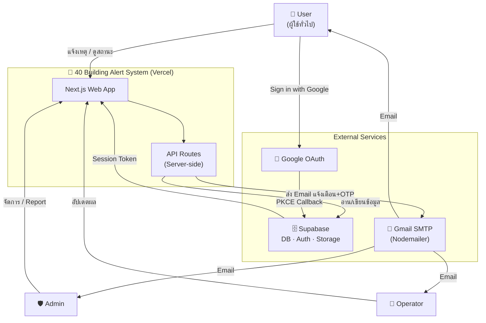

---

## 4. Architecture Diagram

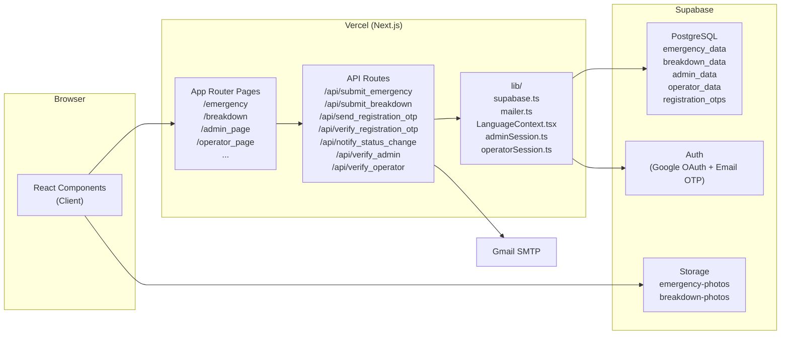

---

## 5. ER Diagram (Database Schema)

```mermaid
erDiagram
    emergency_data {
        int id PK
        timestamptz created_at
        text emergency_type "เป็นลม/อุบัติเหตุ/ทะเลาะ/พบโจร/ล่วงละเมิด/สัตว์กัด/อื่นๆ"
        text floor "ตัวเลข เช่น 3"
        text description
        text email "FK → auth.users.email"
        text status "Waiting/In Process/Success/Failed"
        text photo_url "nullable - Supabase Storage URL"
    }

    breakdown_data {
        int id PK
        timestamptz created_at
        text breakdown_type "ไฟฟ้า/ประปา/แอร์/ลิฟต์/อินเทอร์เน็ต/อุปกรณ์/อื่นๆ"
        text floor "ตัวเลข เช่น 3"
        text description
        text email "FK → auth.users.email"
        text status "Waiting/In Process/Success/Failed"
        text photo_url "nullable - Supabase Storage URL"
    }

    admin_data {
        int id PK
        text first_name
        text last_name
        text email
        text password "salt:hash (scrypt)"
    }

    operator_data {
        int id PK
        text first_name
        text last_name
        text email
        text password "salt:hash (scrypt)"
    }

    registration_otps {
        int id PK
        text email
        text otp_hash "SHA-256 hash"
        text type "user/admin/operator"
        jsonb pending_data "ข้อมูล registration ที่รอ verify"
        timestamptz expires_at "หมดอายุ 10 นาที"
        timestamptz created_at
    }
```

---

## 6. Flowchart — User Registration (Email+Password)

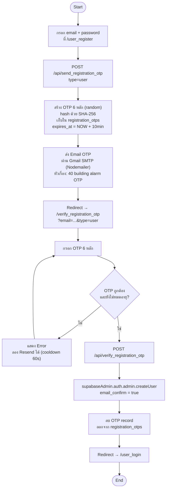

---

## 7. Flowchart — User Login (Google OAuth PKCE)

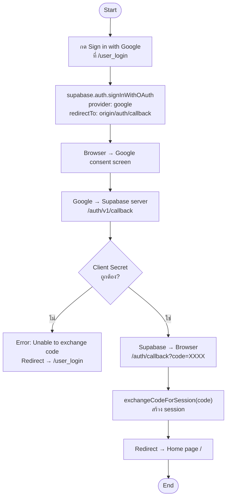

---

## 8. Flowchart — แจ้งเหตุฉุกเฉิน

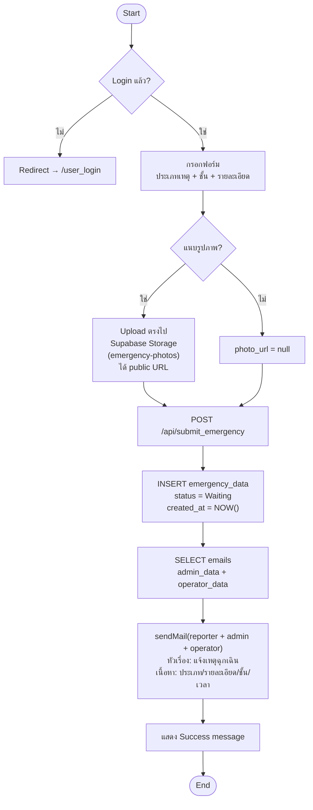

---

## 9. Flowchart — เพิ่ม Admin / Operator

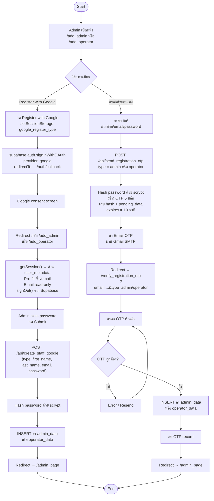

---

## 10. Flowchart — อัปเดต Status

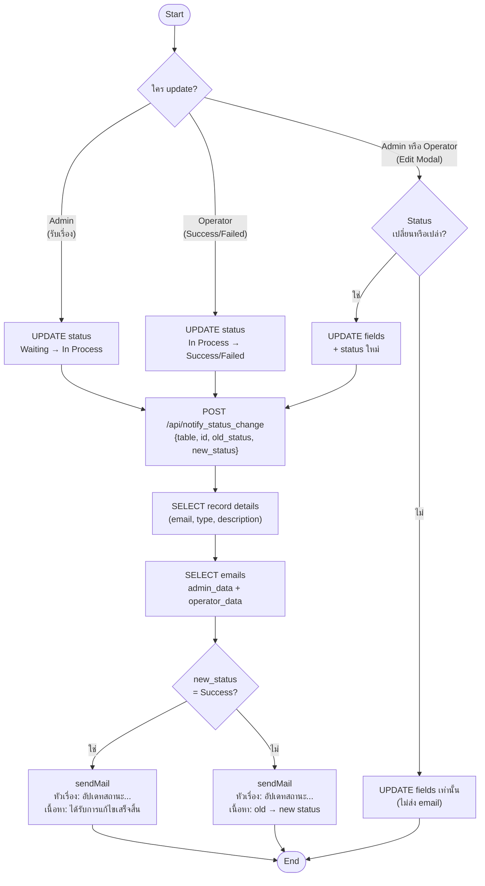

---

## 11. Sequence Diagram — แจ้งเหตุ + Email Notification

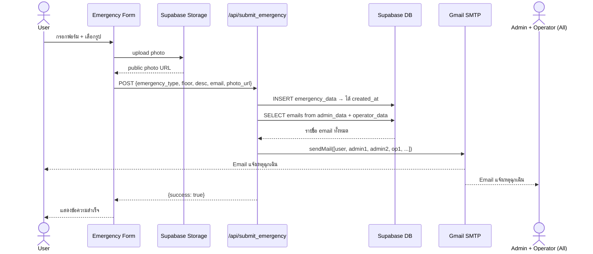

---

## 12. Sequence Diagram — Status Update + Notification

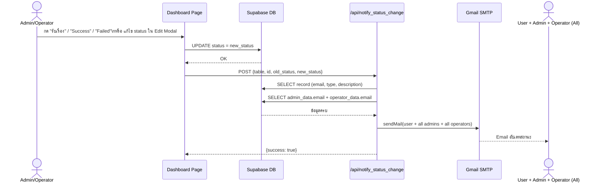

---

## 13. Sequence Diagram — Google OAuth PKCE Flow

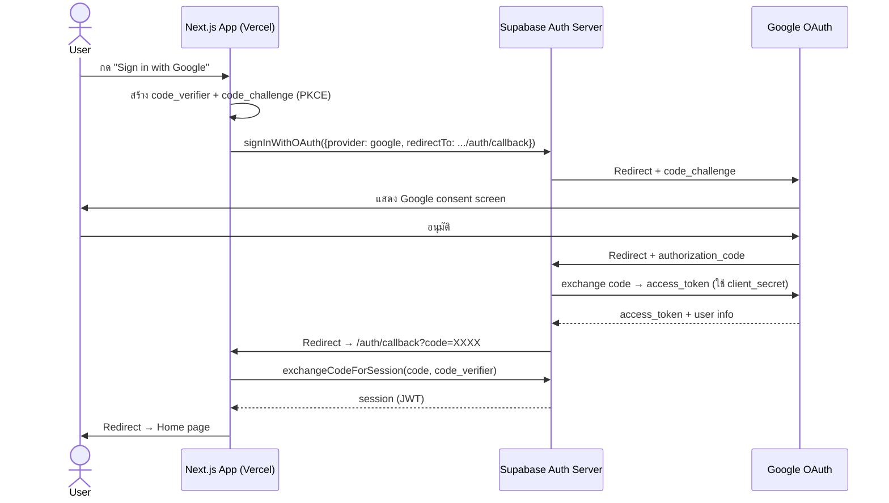

---

## 14. Sequence Diagram — OTP Registration Flow

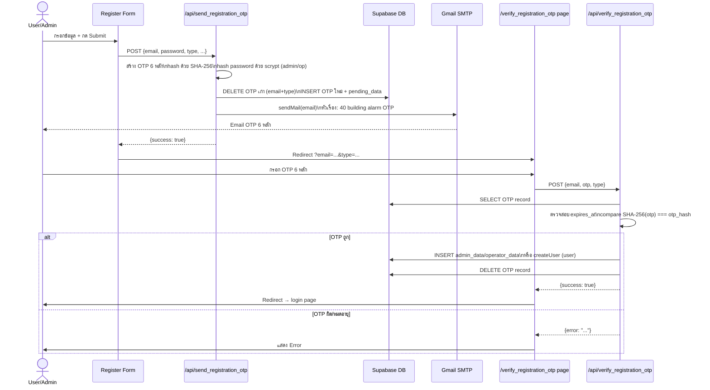

---

## 15. API Endpoints

### User APIs
| Method | Endpoint | Body | คำอธิบาย |
|---|---|---|---|
| POST | `/api/submit_emergency` | `{emergency_type, floor, description, reporter_email, photo_url}` | แจ้งเหตุฉุกเฉิน + ส่ง email ทุกฝ่าย |
| POST | `/api/submit_breakdown` | `{event_type, floor, description, reporter_email, photo_url}` | แจ้งซ่อม + ส่ง email ทุกฝ่าย |
| POST | `/api/send_registration_otp` | `{email, password, type, first_name?, last_name?}` | ส่ง OTP ผ่าน Gmail |
| POST | `/api/verify_registration_otp` | `{email, otp, type}` | Verify OTP + สร้าง account |

### Admin/Operator APIs
| Method | Endpoint | Body | คำอธิบาย |
|---|---|---|---|
| POST | `/api/verify_admin` | `{email, password}` | Admin login (scrypt verify) |
| POST | `/api/verify_operator` | `{email, password}` | Operator login (scrypt verify) |
| POST | `/api/notify_status_change` | `{table, id, old_status, new_status}` | ส่ง email เมื่อ status เปลี่ยน |
| POST | `/api/create_staff_google` | `{type, first_name, last_name, email, password}` | สร้าง Admin/Operator หลัง Google OAuth (ไม่ต้อง OTP) |

---

## 16. Email Notification System

| Event | ผู้รับ | หัวเรื่อง | เนื้อหา |
|---|---|---|---|
| แจ้งเหตุฉุกเฉิน | User + Admin ทุกคน + Operator ทุกคน | แจ้งเหตุฉุกเฉิน | โดย {email} · {ประเภท} : {รายละเอียด} · ชั้น {ชั้น} · เวลา {timestamp} |
| แจ้งเหตุขัดข้อง | User + Admin ทุกคน + Operator ทุกคน | แจ้งเหตุขัดข้อง | โดย {email} · {ประเภท} : {รายละเอียด} · ชั้น {ชั้น} · เวลา {timestamp} |
| อัปเดต status (ทั่วไป) | User + Admin ทุกคน + Operator ทุกคน | อัปเดทสถานะ{ประเภท} | ผู้แจ้ง {email} · {ประเภท} : {รายละเอียด} · สถานะ: old → new |
| อัปเดต status = Success | User + Admin ทุกคน + Operator ทุกคน | อัปเดทสถานะ{ประเภท} | ผู้แจ้ง {email} · {ประเภท} : {รายละเอียด} · ได้รับการแก้ไขเสร็จสิ้น |
| OTP Registration | เฉพาะ email ที่ขอ | 40 building alarm OTP | รหัส OTP 6 หลัก (หมดอายุ 10 นาที) |

---

## 17. โครงสร้างโปรเจค

```
emergency_alert/
├── app/
│   ├── page.tsx                        # Home: ตารางสถานะ · ปุ่ม "สำหรับฉัน" · Pagination · Edit/Delete
│   ├── emergency/page.tsx              # ฟอร์มแจ้งเหตุฉุกเฉิน (เลือกประเภท + รูปภาพ)
│   ├── breakdown/page.tsx              # ฟอร์มแจ้งซ่อม (เลือกประเภท + รูปภาพ)
│   ├── user_login/page.tsx             # Login: Google OAuth + Email+Password
│   ├── user_register/page.tsx          # Register → OTP via Gmail
│   ├── verify_otp/page.tsx             # OTP สำหรับ Supabase Auth (legacy)
│   ├── verify_registration_otp/page.tsx # OTP สำหรับ User/Admin/Operator register
│   ├── auth/callback/page.tsx          # Google PKCE callback (exchangeCodeForSession)
│   ├── contact/page.tsx                # ข้อมูลติดต่อ
│   ├── login_admin/page.tsx            # Admin login
│   ├── admin_page/page.tsx             # Admin dashboard:
│   │                                   #   · ตาราง Emergency + Breakdown (pagination 10/หน้า)
│   │                                   #   · รับเรื่อง (Waiting → In Process)
│   │                                   #   · ดูรูป (modal)
│   │                                   #   · Edit modal (ทุก field + status)
│   │                                   #   · Delete (มี confirmation)
│   │                                   #   · Report: Pie Chart ชั้น + Bar Chart ประเภท
│   │                                   #   · Export Excel (3 sheets) + PDF
│   ├── add_admin/page.tsx              # เพิ่ม Admin → Google OAuth (ไม่ OTP) หรือ Email → OTP
│   ├── add_operator/page.tsx           # เพิ่ม Operator → Google OAuth (ไม่ OTP) หรือ Email → OTP
│   ├── operator_login/page.tsx         # Operator login
│   ├── operator_page/page.tsx          # Operator dashboard:
│   │                                   #   · ตาราง Emergency + Breakdown
│   │                                   #   · Success / Failed buttons
│   │                                   #   · Edit modal + Delete
│   ├── layout.tsx                      # Root layout
│   └── api/
│       ├── submit_emergency/route.ts   # INSERT + Email notification
│       ├── submit_breakdown/route.ts   # INSERT + Email notification
│       ├── send_registration_otp/route.ts  # OTP generate + Gmail send
│       ├── verify_registration_otp/route.ts # OTP verify + create account
│       ├── notify_status_change/route.ts    # Email notification เมื่อ status เปลี่ยน
│       ├── verify_admin/route.ts       # Admin login (scrypt compare)
│       ├── verify_operator/route.ts    # Operator login (scrypt compare)
│       ├── create_staff_google/route.ts # สร้าง Admin/Operator ผ่าน Google OAuth (ไม่ OTP)
│       ├── add_admin/route.ts          # (legacy)
│       └── add_operator/route.ts       # (legacy)
│
├── components/
│   ├── Navbar.tsx                      # Navigation bar
│   │                                   #   · ซ่อน user auth บนหน้า Admin/Operator
│   │                                   #   · EN/TH toggle
│   │                                   #   · User email + logout dropdown
│   ├── Pagination.tsx                  # Dot pagination (useLanguage สำหรับ prev/next)
│   ├── Footer.tsx
│   └── ClientLayout.tsx                # Wrap: LanguageProvider + Navbar + Footer
│
├── lib/
│   ├── supabase.ts                     # Supabase browser client (singleton)
│   ├── mailer.ts                       # Nodemailer transporter + email templates
│   │                                   #   · sendMail(to[], subject, html)
│   │                                   #   · getAllStaffEmails()
│   │                                   #   · emergencySubmitHtml()
│   │                                   #   · breakdownSubmitHtml()
│   │                                   #   · statusUpdateHtml()
│   │                                   #   · formatTimestamp() · displayFloor()
│   ├── useUserAuth.ts                  # Hook: redirect → /user_login ถ้าไม่มี session
│   ├── adminSession.ts                 # set/get/clear admin session (localStorage)
│   ├── useAdminSession.ts              # Hook: redirect → /login_admin ถ้า session หมด
│   ├── operatorSession.ts              # set/get/clear operator session
│   ├── useOperatorSession.ts           # Hook: redirect → /operator_login
│   └── LanguageContext.tsx             # i18n: TH/EN · translations object · t(key)
│
├── public/
│   ├── KMUTNB_Logo.svg.png
│   ├── emergency_cat.png
│   └── breakdown_dog.png
│
├── next.config.ts
├── .env.local                          # ⚠️ ไม่ commit ลง Git
└── .env.example
```

---

## 18. Database Tables ใน Supabase

### `emergency_data`
| Column | Type | หมายเหตุ |
|---|---|---|
| id | int (PK) | auto increment |
| created_at | timestamptz | Supabase default |
| emergency_type | text | ประเภทเหตุ (canonical Thai หรือ custom) |
| floor | text | เก็บเป็นตัวเลข เช่น "3" |
| description | text | รายละเอียด |
| email | text | email ผู้แจ้ง |
| status | text | Waiting / In Process / Success / Failed |
| photo_url | text (nullable) | URL จาก Supabase Storage |
| finish_at | timestamptz (nullable) | บันทึกเมื่อ status เปลี่ยนเป็น Success |

### `breakdown_data`
| Column | Type | หมายเหตุ |
|---|---|---|
| id | int (PK) | auto increment |
| created_at | timestamptz | |
| breakdown_type | text | ประเภทขัดข้อง |
| floor | text | ตัวเลข เช่น "3" |
| description | text | |
| email | text | |
| status | text | Waiting / In Process / Success / Failed |
| photo_url | text (nullable) | |
| finish_at | timestamptz (nullable) | บันทึกเมื่อ status เปลี่ยนเป็น Success |

### `admin_data` / `operator_data`
| Column | Type | หมายเหตุ |
|---|---|---|
| id | int (PK) | |
| first_name | text | |
| last_name | text | |
| email | text | |
| password | text | `salt:hash` (scrypt 64 bytes) |

### `registration_otps`
| Column | Type | หมายเหตุ |
|---|---|---|
| id | int (PK) | |
| email | text | email ที่ขอ OTP |
| otp_hash | text | SHA-256(OTP) |
| type | text | user / admin / operator |
| pending_data | jsonb | ข้อมูล registration รอ verify |
| expires_at | timestamptz | NOW() + 10 นาที |
| created_at | timestamptz | |

---

## 19. Supabase Storage

| Bucket | Access | ใช้สำหรับ |
|---|---|---|
| `emergency-photos` | Public read · Auth upload | รูปภาพแนบการแจ้งเหตุฉุกเฉิน |
| `breakdown-photos` | Public read · Auth upload | รูปภาพแนบการแจ้งซ่อม |

รูปภาพ upload จาก **client** โดยตรงด้วย user JWT → ได้ public URL → ส่งไป API → บันทึกใน DB

---

## 20. Session Management

| ผู้ใช้ | วิธีเก็บ session | หมดอายุ | Reset timer |
|---|---|---|---|
| User | Supabase Auth JWT (localStorage auto) | ตาม Supabase config | อัตโนมัติ (refresh token) |
| Admin | Custom localStorage + timestamp | **10 นาที** | ทุก mouse/keyboard/scroll/touch event |
| Operator | Custom localStorage + timestamp | **10 นาที** | เหมือนกัน |

Admin/Operator: ตรวจสอบทุก **30 วินาที** — ถ้าหมด → redirect กลับหน้า login อัตโนมัติ

---

## 21. Security

| จุด | วิธีป้องกัน |
|---|---|
| Admin/Operator password | scrypt (salt 16 bytes, hash 64 bytes) + timingSafeEqual |
| OTP | SHA-256 hash ก่อนเก็บ · หมดอายุ 10 นาที · ลบทันทีหลัง verify |
| Google OAuth | PKCE flow (code_verifier ไม่ผ่าน network) |
| Email credentials | Environment Variables (ไม่ commit Git) |
| Supabase RLS | anon + authenticated access control |
| Session | ตรวจสอบทุก 30 วินาที + activity-based reset |

---

## 22. i18n (Bilingual)

รองรับ **ไทย (TH)** และ **อังกฤษ (EN)** — สลับได้ทันทีใน Navbar

ครอบคลุม: ปุ่ม · headers · labels · status · ประเภท · loading states · error messages · pagination

ข้อมูลที่เก็บใน DB ใช้รูปแบบ **canonical** (ตัวเลขสำหรับชั้น, Thai canonical สำหรับประเภทเหตุฉุกเฉิน) — แสดงผลด้วยฟังก์ชัน `displayFloor()` และ `displayEmergencyType()`

---

## 23. การติดตั้งและ Deploy

### Local Development

```bash
git clone https://github.com/baitankub-boop/emergency_alert.git
cd emergency_alert
pnpm install
```

สร้าง `.env.local`:
```env
NEXT_PUBLIC_SUPABASE_URL=https://zqrlqanbnuwrvvqvcetx.supabase.co
NEXT_PUBLIC_SUPABASE_ANON_KEY=<anon key>
SUPABASE_SECRET_KEY=<service role key>
EMAIL_USER=baitankub@gmail.com
EMAIL_PASS=<gmail app password>
```

```bash
pnpm dev    # http://localhost:3000
```

### Deploy to Vercel

1. Push code ขึ้น GitHub
2. Import repo ที่ [vercel.com](https://vercel.com)
3. ตั้ง Environment Variables ใน Vercel dashboard (5 ตัวเดียวกัน)
4. Deploy

**Supabase → Authentication → URL Configuration → Redirect URLs:**
```
http://localhost:3000/auth/callback
https://emergency-alert-gilt.vercel.app/auth/callback
```

### Supabase SQL Setup

```sql
-- เพิ่ม columns
ALTER TABLE emergency_data ADD COLUMN IF NOT EXISTS emergency_type TEXT;
ALTER TABLE emergency_data ADD COLUMN IF NOT EXISTS photo_url TEXT;
ALTER TABLE emergency_data ADD COLUMN IF NOT EXISTS finish_at TIMESTAMPTZ;
ALTER TABLE breakdown_data ADD COLUMN IF NOT EXISTS photo_url TEXT;
ALTER TABLE breakdown_data ADD COLUMN IF NOT EXISTS finish_at TIMESTAMPTZ;

-- OTP table
CREATE TABLE registration_otps (
  id SERIAL PRIMARY KEY,
  email TEXT NOT NULL,
  otp_hash TEXT NOT NULL,
  type TEXT NOT NULL,
  pending_data JSONB NOT NULL,
  expires_at TIMESTAMPTZ NOT NULL,
  created_at TIMESTAMPTZ DEFAULT NOW()
);
ALTER TABLE registration_otps ENABLE ROW LEVEL SECURITY;
CREATE POLICY "allow_registration_otp" ON registration_otps
FOR ALL TO anon, authenticated USING (true) WITH CHECK (true);

-- RLS สำหรับ emergency/breakdown (anon + authenticated อ่านได้)
-- Storage policies (authenticated upload)
```

---

## 24. Features Summary

### User
- ✅ Login Google OAuth (PKCE) — ไม่ต้อง OTP
- ✅ Register Email+Password → OTP ผ่าน Gmail
- ✅ แจ้งเหตุฉุกเฉิน (6 ประเภท + อื่นๆ)
- ✅ แจ้งซ่อม (6 ประเภท + อื่นๆ)
- ✅ แนบรูปภาพ (preview ก่อน submit)
- ✅ ดูเฉพาะรายการตัวเอง ("สำหรับฉัน")
- ✅ แก้ไขรายการตัวเอง (เฉพาะ Waiting)
- ✅ ลบรายการตัวเอง (พร้อม confirmation)
- ✅ รับ email แจ้งเตือนทุก event

### Admin
- ✅ ดูรายการทั้งหมด (Pagination 10 rows/หน้า)
- ✅ รับเรื่อง (Waiting → In Process) + email notification
- ✅ ดูรูปภาพ (modal)
- ✅ แก้ไขทุก field + status ทุก record
- ✅ ลบ record (พร้อม confirmation)
- ✅ Report: Pie Chart ชั้นบ่อย + Bar Chart ประเภทบ่อย (Emergency + Breakdown แยกกัน)
- ✅ Export Excel (Emergency sheet + Breakdown sheet + Summary sheet)
- ✅ Export PDF (Summary + ตารางข้อมูล)
- ✅ เพิ่ม Admin/Operator ใหม่ → Google OAuth (ไม่ต้อง OTP) หรือ Email → OTP via Gmail
- ✅ รับ email แจ้งเตือนทุก event

### Operator
- ✅ ดูรายการทั้งหมด (Pagination)
- ✅ อัปเดต Success / Failed + email notification
- ✅ ดูรูปภาพ (modal)
- ✅ แก้ไขทุก field + status
- ✅ ลบ record
- ✅ รับ email แจ้งเตือนทุก event

### ระบบ
- ✅ Bilingual UI (TH/EN สลับได้ทันที)
- ✅ Responsive (mobile + desktop)
- ✅ Navbar ซ่อน user auth บนหน้า Admin/Operator
- ✅ Auto-redirect เมื่อ session หมด
- ✅ Status flow: Waiting → In Process → Success/Failed

---

## 25. Status Flow

```
Waiting ──► In Process ──► Success
                      └──► Failed
```

Email notification ถูกส่งทุกครั้งที่ status เปลี่ยน ไปยัง: **User ผู้แจ้ง + Admin ทุกคน + Operator ทุกคน**
