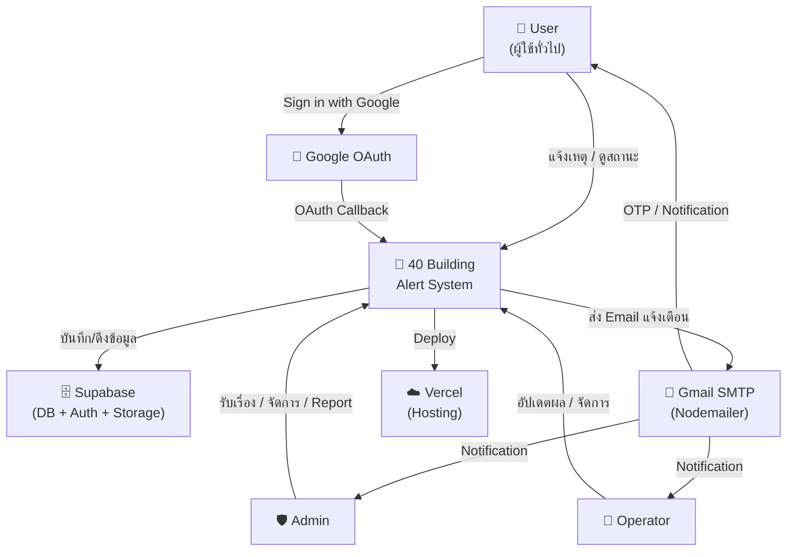
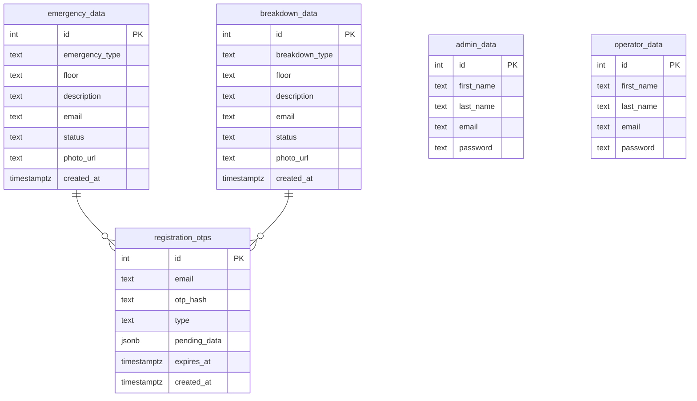
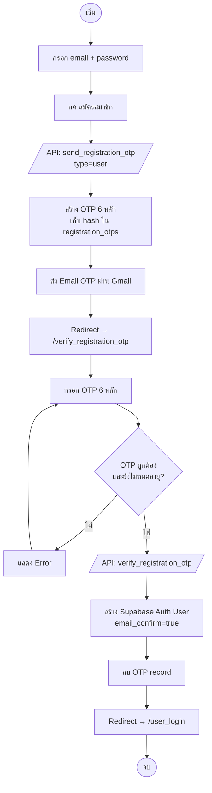
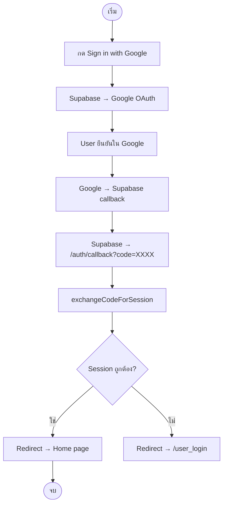
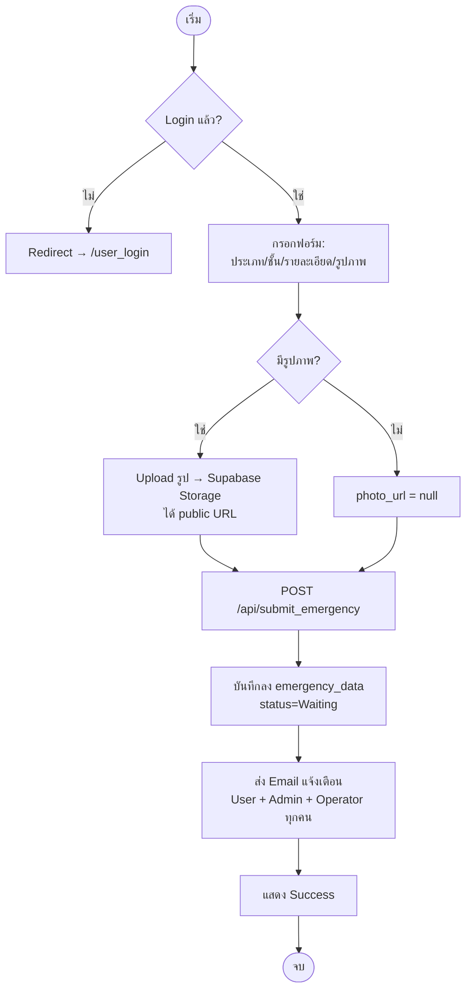
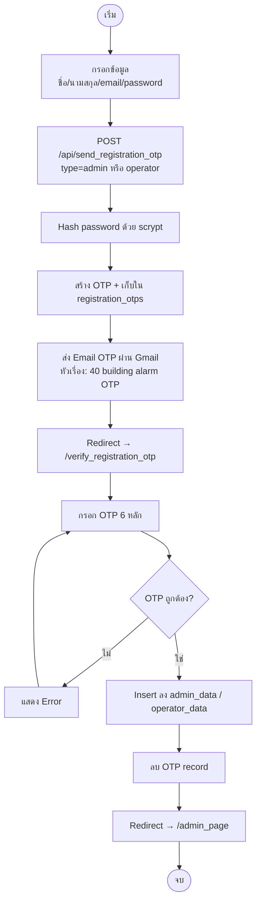
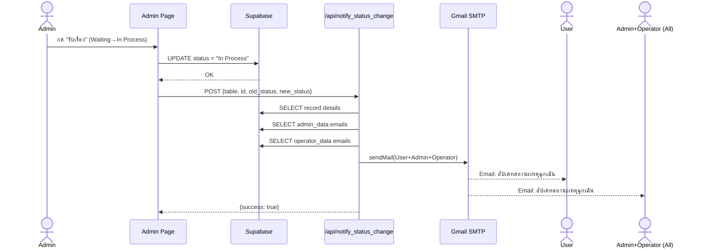
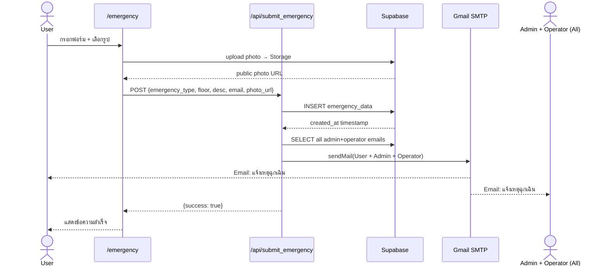

# 🚨 40 Building Emergency Alert System

ระบบแจ้งเหตุฉุกเฉินและแจ้งซ่อมอาคาร 40 มหาวิทยาลัยเทคโนโลยีพระจอมเกล้าพระนครเหนือ (KMUTNB)

**GitHub:** https://github.com/baitankub-boop/emergency_alert  
**Deploy:** Vercel (พร้อม deploy ✓)

---

## ภาพรวม (Overview)

เว็บแอปพลิเคชันบริหารจัดการเหตุฉุกเฉินและแจ้งซ่อมภายในอาคาร 40 แบ่งผู้ใช้ออกเป็น 3 กลุ่ม:

| กลุ่มผู้ใช้ | สิทธิ์ |
|---|---|
| **User** | สมัครสมาชิก / Login (Google หรือ Email+OTP) → แจ้งเหตุ → ดู/แก้ไข/ลบรายการของตัวเอง |
| **Admin** | ดูข้อมูลทั้งหมด → รับเรื่อง → แก้ไข/ลบทุก record → ดู Report → Export Excel/PDF → เพิ่ม Admin/Operator |
| **Operator** | ดูข้อมูลทั้งหมด → อัปเดตผล (Success/Failed) → แก้ไข/ลบทุก record |

---

## Tech Stack

| ส่วน | เทคโนโลยี |
|---|---|
| Framework | Next.js 16 (App Router) |
| Language | TypeScript |
| UI | React 19 + Tailwind CSS |
| Database | Supabase (PostgreSQL) |
| File Storage | Supabase Storage |
| Auth (User) | Supabase Auth — Google OAuth (PKCE) + Email+Password+OTP |
| Auth (Admin/Operator) | localStorage session (10 นาที) + scrypt password hashing |
| Email | Nodemailer + Gmail SMTP |
| Charts (Report) | SVG Pie Chart (ไม่ต้องติดตั้ง library) |
| Export | xlsx (Excel), jsPDF + jspdf-autotable (PDF) |
| i18n | Custom LanguageContext (TH / EN) |

---

## Context Diagram



---

## ER Diagram (Database)



> **หมายเหตุ:** User accounts จัดการโดย Supabase Auth (`auth.users`) — ไม่มี custom table

---

## Flowchart — User Registration (Email)



---

## Flowchart — User Login (Google OAuth PKCE)



---

## Flowchart — แจ้งเหตุฉุกเฉิน



---

## Flowchart — Admin เพิ่ม Admin/Operator ใหม่



---

## Sequence Diagram — Status Update & Email Notification



---

## Sequence Diagram — User แจ้งเหตุและรับ Email



---

## Database Schema

### `emergency_data`
| Column | Type | Description |
|---|---|---|
| `id` | int | Primary key |
| `created_at` | timestamptz | เวลาที่แจ้ง |
| `emergency_type` | text | ประเภท (เป็นลม/อุบัติเหตุ/ทะเลาะวิวาท/พบโจร/ล่วงละเมิด/สัตว์กัด/อื่นๆ) |
| `floor` | text | ชั้น (เก็บเป็นตัวเลข เช่น "3") |
| `description` | text | รายละเอียด |
| `email` | text | อีเมลผู้แจ้ง |
| `status` | text | `Waiting` → `In Process` → `Success` / `Failed` |
| `photo_url` | text | URL รูปภาพจาก Supabase Storage (nullable) |

### `breakdown_data`
| Column | Type | Description |
|---|---|---|
| `id` | int | Primary key |
| `created_at` | timestamptz | เวลาที่แจ้ง |
| `breakdown_type` | text | ประเภท (ไฟฟ้า/ประปา/แอร์/ลิฟต์/อินเทอร์เน็ต/อุปกรณ์/อื่นๆ) |
| `floor` | text | ชั้น (ตัวเลข เช่น "3") |
| `description` | text | รายละเอียด |
| `email` | text | อีเมลผู้แจ้ง |
| `status` | text | `Waiting` → `In Process` → `Success` / `Failed` |
| `photo_url` | text | URL รูปภาพจาก Supabase Storage (nullable) |

### `admin_data` / `operator_data`
| Column | Type | Description |
|---|---|---|
| `id` | int | Primary key |
| `first_name` | text | ชื่อ |
| `last_name` | text | นามสกุล |
| `email` | text | อีเมล |
| `password` | text | `salt:hash` (scrypt) |

### `registration_otps`
| Column | Type | Description |
|---|---|---|
| `id` | int | Primary key |
| `email` | text | อีเมลที่ขอ OTP |
| `otp_hash` | text | SHA-256 hash ของ OTP |
| `type` | text | `user` / `admin` / `operator` |
| `pending_data` | jsonb | ข้อมูล registration ที่รอ verify |
| `expires_at` | timestamptz | หมดอายุใน 10 นาที |
| `created_at` | timestamptz | เวลาสร้าง |

---

## Email Notification System

| Event | ส่งถึง | หัวเรื่อง |
|---|---|---|
| แจ้งเหตุฉุกเฉิน | User + Admin ทุกคน + Operator ทุกคน | แจ้งเหตุฉุกเฉิน |
| แจ้งเหตุขัดข้อง | User + Admin ทุกคน + Operator ทุกคน | แจ้งเหตุขัดข้อง |
| อัปเดต status | User + Admin ทุกคน + Operator ทุกคน | อัปเดทสถานะเหตุ... |
| OTP (User/Admin/Operator) | เฉพาะ email ที่ขอ | 40 building alarm OTP |

---

## API Endpoints

### Public APIs
| Method | Endpoint | Description |
|---|---|---|
| POST | `/api/submit_emergency` | แจ้งเหตุฉุกเฉิน + ส่ง email |
| POST | `/api/submit_breakdown` | แจ้งเหตุขัดข้อง + ส่ง email |
| POST | `/api/verify_admin` | Login Admin |
| POST | `/api/verify_operator` | Login Operator |
| POST | `/api/send_registration_otp` | ส่ง OTP สำหรับ register (user/admin/operator) |
| POST | `/api/verify_registration_otp` | Verify OTP + สร้าง account |
| POST | `/api/notify_status_change` | ส่ง email เมื่อ status เปลี่ยน |

### Admin-only APIs
| Method | Endpoint | Description |
|---|---|---|
| POST | `/api/add_admin` | เพิ่ม Admin (legacy, ใช้ OTP flow แทน) |
| POST | `/api/add_operator` | เพิ่ม Operator (legacy) |

---

## Supabase Storage

| Bucket | ใช้สำหรับ |
|---|---|
| `emergency-photos` | รูปภาพแนบกับการแจ้งเหตุฉุกเฉิน |
| `breakdown-photos` | รูปภาพแนบกับการแจ้งซ่อม |

---

## Supabase RLS Policies ที่จำเป็น

```sql
-- emergency_data, breakdown_data: อ่านได้ทุก role
ALTER POLICY ... TO anon, authenticated USING (true);

-- registration_otps: อนุญาตทุก operation
CREATE POLICY "allow_registration_otp" ON registration_otps
FOR ALL TO anon, authenticated USING (true) WITH CHECK (true);

-- Storage upload
CREATE POLICY "auth users upload emergency photos"
ON storage.objects FOR INSERT TO authenticated
WITH CHECK (bucket_id = 'emergency-photos');

CREATE POLICY "auth users upload breakdown photos"
ON storage.objects FOR INSERT TO authenticated
WITH CHECK (bucket_id = 'breakdown-photos');
```

---

## Session Management

| ผู้ใช้ | ระบบ | Timeout |
|---|---|---|
| User | Supabase Auth JWT (localStorage) | ตาม Supabase config |
| Admin / Operator | Custom localStorage session | **10 นาที** (reset เมื่อมี activity) |

---

## โครงสร้างโปรเจค (Project Structure)

```
emergency_alert/
├── app/
│   ├── page.tsx                      # Home — ตารางสถานะ + สำหรับฉัน + แก้ไข/ลบ
│   ├── emergency/page.tsx            # ฟอร์มแจ้งเหตุฉุกเฉิน (ประเภท + รูป)
│   ├── breakdown/page.tsx            # ฟอร์มแจ้งซ่อม (ประเภท + รูป)
│   ├── user_login/page.tsx           # Login (Google / Email+Password)
│   ├── user_register/page.tsx        # Register → OTP
│   ├── verify_otp/page.tsx           # OTP สำหรับ Supabase Auth (legacy)
│   ├── verify_registration_otp/page.tsx  # OTP สำหรับ User/Admin/Operator register
│   ├── auth/callback/page.tsx        # Google OAuth PKCE callback
│   ├── contact/page.tsx
│   ├── login_admin/page.tsx          # Admin login
│   ├── admin_page/page.tsx           # Admin dashboard (Table + Report + Export)
│   ├── add_admin/page.tsx            # เพิ่ม Admin → OTP
│   ├── add_operator/page.tsx         # เพิ่ม Operator → OTP
│   ├── operator_login/page.tsx       # Operator login
│   ├── operator_page/page.tsx        # Operator dashboard
│   ├── layout.tsx
│   └── api/
│       ├── submit_emergency/route.ts
│       ├── submit_breakdown/route.ts
│       ├── send_registration_otp/route.ts
│       ├── verify_registration_otp/route.ts
│       ├── notify_status_change/route.ts
│       ├── verify_admin/route.ts
│       ├── verify_operator/route.ts
│       ├── add_admin/route.ts
│       └── add_operator/route.ts
│
├── components/
│   ├── Navbar.tsx                    # Navigation (ซ่อน user auth บนหน้า Admin/Operator)
│   ├── Footer.tsx
│   ├── Pagination.tsx                # Dot pagination (10 rows/page)
│   └── ClientLayout.tsx
│
├── lib/
│   ├── supabase.ts                   # Supabase browser client
│   ├── mailer.ts                     # Nodemailer + email templates
│   ├── useUserAuth.ts                # Hook ป้องกันหน้า User
│   ├── adminSession.ts / useAdminSession.ts
│   ├── operatorSession.ts / useOperatorSession.ts
│   └── LanguageContext.tsx           # i18n (TH / EN)
│
├── public/
│   ├── KMUTNB_Logo.svg.png
│   ├── emergency_cat.png
│   └── breakdown_dog.png
│
├── next.config.ts
├── .env.local                        # ไม่ commit ลง Git
└── .env.example
```

---

## การติดตั้ง (Setup)

### 1. Clone และติดตั้ง dependencies
```bash
git clone https://github.com/baitankub-boop/emergency_alert.git
cd emergency_alert
pnpm install
```

### 2. Environment Variables (`.env.local`)
```env
NEXT_PUBLIC_SUPABASE_URL=https://<project>.supabase.co
NEXT_PUBLIC_SUPABASE_ANON_KEY=<anon-key>
SUPABASE_SECRET_KEY=<service-role-key>
EMAIL_USER=your-gmail@gmail.com
EMAIL_PASS=xxxx xxxx xxxx xxxx
```

> **Gmail App Password:** Google Account → Security → 2-Step Verification → App passwords

### 3. Supabase SQL Setup
```sql
-- 1. เพิ่ม column
ALTER TABLE emergency_data ADD COLUMN IF NOT EXISTS emergency_type TEXT;
ALTER TABLE emergency_data ADD COLUMN IF NOT EXISTS photo_url TEXT;
ALTER TABLE breakdown_data ADD COLUMN IF NOT EXISTS photo_url TEXT;

-- 2. OTP table
CREATE TABLE registration_otps (
  id SERIAL PRIMARY KEY,
  email TEXT NOT NULL,
  otp_hash TEXT NOT NULL,
  type TEXT NOT NULL,
  pending_data JSONB NOT NULL,
  expires_at TIMESTAMPTZ NOT NULL,
  created_at TIMESTAMPTZ DEFAULT NOW()
);
ALTER TABLE registration_otps ENABLE ROW LEVEL SECURITY;
CREATE POLICY "allow_registration_otp" ON registration_otps
FOR ALL TO anon, authenticated USING (true) WITH CHECK (true);

-- 3. RLS สำหรับ emergency/breakdown
ALTER TABLE emergency_data ENABLE ROW LEVEL SECURITY;
ALTER TABLE breakdown_data ENABLE ROW LEVEL SECURITY;
-- (ดู RLS Policies section ด้านบน)

-- 4. Storage buckets (สร้างใน Supabase Dashboard → Storage)
-- emergency-photos (Public: ✓)
-- breakdown-photos (Public: ✓)
```

### 4. รัน Development Server
```bash
pnpm dev
```

---

## Deploy ลง Vercel

### ขั้นตอน
1. Push code ขึ้น GitHub:
   ```bash
   git add .
   git commit -m "deploy"
   git push
   ```
2. ไปที่ [vercel.com](https://vercel.com) → Import `emergency_alert` repository
3. ตั้งค่า Environment Variables ใน Vercel dashboard (เหมือนกับ `.env.local`)
4. Deploy ✓

### Environment Variables ที่ต้องตั้งใน Vercel
```
NEXT_PUBLIC_SUPABASE_URL
NEXT_PUBLIC_SUPABASE_ANON_KEY
SUPABASE_SECRET_KEY
EMAIL_USER
EMAIL_PASS
```

---

## Google OAuth Setup

1. [Google Cloud Console](https://console.cloud.google.com/) → APIs & Services → Credentials
2. OAuth 2.0 Client ID → Authorized redirect URIs:
   ```
   https://<project>.supabase.co/auth/v1/callback
   ```
3. Supabase Dashboard → Authentication → Providers → Google
4. Supabase → Authentication → URL Configuration → Redirect URLs:
   ```
   http://localhost:3000/auth/callback
   https://<your-vercel-domain>/auth/callback
   ```

---

## Features ทั้งหมด

### User
- ✅ Login ด้วย Google OAuth (PKCE, ไม่ต้อง OTP)
- ✅ Register ด้วย Email+Password → OTP via Gmail
- ✅ แจ้งเหตุฉุกเฉิน (พร้อมเลือกประเภท: เป็นลม/อุบัติเหตุ/ทะเลาะวิวาท/พบโจร/ล่วงละเมิด/สัตว์กัด)
- ✅ แจ้งเหตุขัดข้อง (พร้อมเลือกประเภท: ไฟฟ้า/ประปา/แอร์/ลิฟต์/อินเทอร์เน็ต/อุปกรณ์)
- ✅ แนบรูปภาพ (upload → Supabase Storage)
- ✅ Auto-fill email จาก session
- ✅ ดูรายการตัวเอง (ปุ่ม "สำหรับฉัน")
- ✅ แก้ไขรายการตัวเอง (เฉพาะ status Waiting)
- ✅ ลบรายการตัวเอง (พร้อม confirmation)
- ✅ รับ email แจ้งเตือนทุก event

### Admin
- ✅ Login ด้วย email+password (custom auth + scrypt)
- ✅ ดูรายการทั้งหมด (Emergency + Breakdown) พร้อม pagination 10 rows/หน้า
- ✅ รับเรื่อง (Waiting → In Process)
- ✅ ดูรูปภาพ (modal)
- ✅ แก้ไขทุก field + status ทุก record
- ✅ ลบ record (พร้อม confirmation)
- ✅ Report Dashboard: สถิติ status + Pie Chart ชั้นที่มีเหตุบ่อย + Bar Chart ประเภทบ่อย
- ✅ Export Excel (3 sheets: Emergency, Breakdown, Summary)
- ✅ Export PDF (Summary + tables)
- ✅ เพิ่ม Admin/Operator ใหม่ → OTP via Gmail
- ✅ รับ email แจ้งเตือนทุก event

### Operator
- ✅ Login ด้วย email+password (custom auth)
- ✅ ดูรายการทั้งหมด พร้อม pagination
- ✅ อัปเดต status (Success / Failed)
- ✅ ดูรูปภาพ (modal)
- ✅ แก้ไขทุก field + status
- ✅ ลบ record
- ✅ รับ email แจ้งเตือนทุก event

### ระบบทั่วไป
- ✅ Bilingual UI (ภาษาไทย / อังกฤษ) สลับได้ทันที
- ✅ Responsive design (mobile + desktop)
- ✅ Session guard (auto-redirect เมื่อ session หมด)
- ✅ Navbar ซ่อน user auth บนหน้า Admin/Operator
- ✅ Status badge: Waiting (เหลือง) / In Process (น้ำเงิน) / Success (เขียว) / Failed (แดง)

---

## Status Flow

```
Waiting ──► In Process ──► Success
                      └──► Failed
```